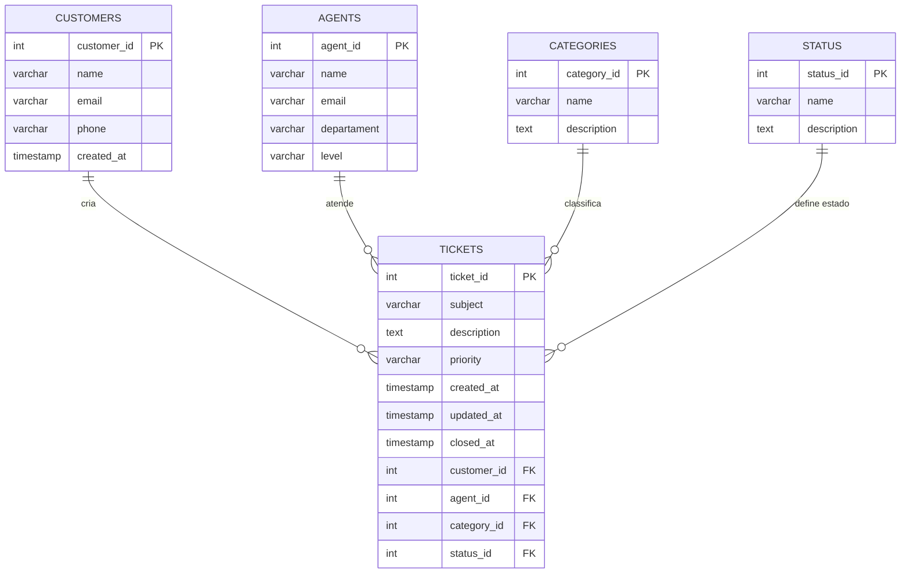

# 🎟️ Sistema de Gerenciamento de Tickets  
Projeto desenvolvido para consolidar o aprendizado em **modelagem, estruturação e manipulação de dados** em **PostgreSQL**, simulando o funcionamento de um sistema real de **Suporte ao Cliente**. O projeto foi construído utilizando o **Beekeeper Studio** para gerenciamento e execução das consultas.

---

## 🧠 Objetivo  
Simular o funcionamento de um sistema de suporte técnico, passando por todas as etapas do desenvolvimento de um banco de dados relacional — desde a **modelagem conceitual e lógica** até a **implementação prática das tabelas, consultas e triggers** automatizadas.  

O sistema foi projetado para refletir um ambiente de atendimento ao cliente em empresas SaaS, permitindo análises e práticas próximas ao cotidiano de um **Analista de Suporte ao Cliente**.

---

## 🧱 Tecnologias e ferramentas utilizadas  
- **PostgreSQL**  
- **Beekeeper Studio**  
- **Modelagem Entidade-Relacionamento (ER)**  
- **Modelagem Lógica de Dados**  

---

## ⚙️ Estrutura e funcionalidades  
O projeto inclui:

- Criação e normalização das tabelas principais (clientes, agentes, categorias, status e tickets);  
- Inserção de **100 registros simulados de tickets** distribuídos entre diferentes clientes, agentes e status;  
- Desenvolvimento de consultas SQL que representam cenários reais de suporte;  
- Criação de **triggers automatizadas** para atualização de registros e controle de encerramento de tickets;  
- Implementação de **restrições de integridade referencial** (chaves primárias e estrangeiras).  

---

## 📊 Consultas simuladas  
Algumas das consultas desenvolvidas incluem:

- Quantidade de tickets por status (aberto, em andamento, resolvido, fechado);  
- Volume de tickets por agente e categoria;  
- Tempo médio de resolução de tickets;  
- Tickets com prioridade alta ou pendentes de atendimento;  
- Análise de desempenho individual de cada agente;  
- Total de tickets abertos por cliente.  

Esses cenários simulam **consultas operacionais e analíticas** comuns em áreas de suporte e sucesso do cliente, aplicando conceitos de **agregação, junção e otimização de consultas SQL**.

---

## 🧩 Modelagem do Banco  
A base do projeto foi construída a partir de:

- **Modelo Conceitual (DER)** – definição das entidades, atributos e relacionamentos entre clientes, agentes e tickets;  
- **Modelo Lógico** – estruturação do banco no PostgreSQL conforme boas práticas de normalização;  
- **Implementação Física** – criação das tabelas, inserções de dados e triggers no **Beekeeper Studio**.  

---

## ⚙️ Rotinas automatizadas (Triggers)  
Foram criadas rotinas para garantir a atualização e integridade dos dados:

- **Atualização automática do campo `updated_at`** sempre que um ticket é modificado;  
- **Preenchimento automático do campo `closed_at`** quando o status do ticket muda para “Fechado”.  

Esses recursos simulam automações de sistemas reais de atendimento e garantem maior controle sobre o ciclo de vida dos tickets.

---

## 🗺️ Modelo Conceitual (Diagrama ER)
O diagrama abaixo representa as entidades e seus relacionamentos principais:

## 🚀 Resultados
- O projeto reforçou o domínio sobre:
- Estruturação e integridade de dados relacionais;
- Criação de **consultas avançadas e indicadores de suporte**;
- Aplicação de **triggers e funções automatizadas**;
- Organização, documentação e versionamento do projeto com Git/GitHub.

## 🏁 Conclusão
Esse projeto sintetiza o aprendizado adquirido durante o curso e representa um exemplo prático de como bancos de dados podem ser utilizados para **organizar, monitorar e otimizar fluxos de suporte ao cliente** em ambientes corporativos e de tecnologia.

### 📎
**Kaique da Cunha Cavalcanti Martins**  
📧 [LinkedIn](https://www.linkedin.com/in/kaiqueccmartins)  
💻 Projeto desenvolvido como parte dos estudos de **Banco de Dados e Suporte ao Cliente em Tecnologia**.
